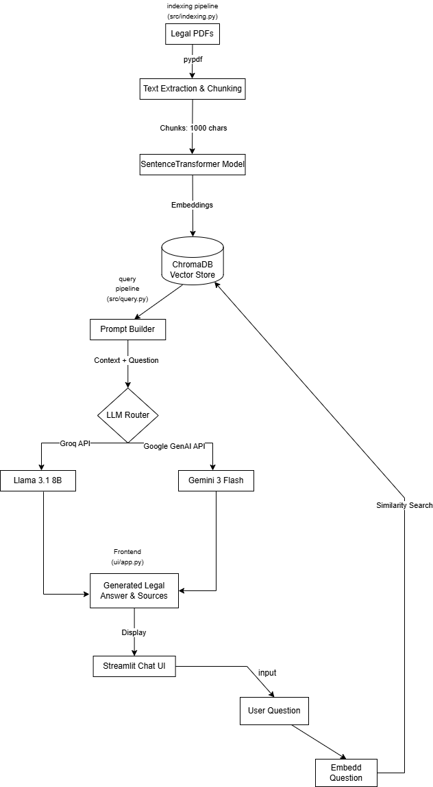

# 🤖 RAG Starter Pack — UTS Data Engineering

> **Retrieval-Augmented Generation** — Sistem Tanya-Jawab Cerdas Berbasis Dokumen

Starter pack ini adalah **kerangka awal** proyek RAG untuk UTS Data Engineering D4.

Tujuan dari project ini adalah untuk membantu seseorang dalam mengecek usaha yang ingin di jalankan, apakah usaha tersebut legal atau tidak.

---

## 👥 Identitas Kelompok

| Nama | NIM | Tugas Utama |
|------|-----|-------------|
| Dzakwan Daris Fakhruddin  | 244311011 |   Data Engineer    |
| Takeru Putra Nojima  | 244311029 |       Data Analysis  |
| Dea Riftya Ananda | 244311008|  Project Manager        |

**Topik Domain:** *Pengecekan Legalitas Pada Badan Usaha Berdasarkan Undang-Undang*  
**Stack yang Dipilih:** *From Scratch*  
**LLM yang Digunakan:** *Gemini, Llama*  
**Vector DB yang Digunakan:** *ChromaDB*

---

## 🗂️ Struktur Proyek

```
rag-uts-[kelompok 9]/
├── data/                    
   └── Salinan Perpres Nomor 10 Tahun 2021.pdf
   └── Lampiran I Salinan Perpres Nomor 10 Tahun 2021.pdf
   └── Lampiran II Salinan Perpres Nomor 10 Tahun 2021.pdf
   └── Lampiran III Salinan Perpres Nomor 10 Tahun 2021.pdf
   └── laporan-lkpm-non-umk-triwulan-i-2023.xlsx
   └── Permenkumham Nomor 17 Tahun 2018.pdf
   └── Perpres Nomor 10 Tahun 2021.pdf
   └── PP Nomor 5 Tahun 2021_penjelasan.pdf
   └── PP Nomor 5 Tahun 2021.pdf
   └── UU Nomor 6 Tahun 2023.pdf
   └── UU Nomor 40 Tahun 2007.pdf                
├── src/
│   ├── indexing.py         
│   ├── query.py            
│   ├── embeddings.py
├── ui/
│   └── app.py               # 🔧 WAJIB DIISI: Antarmuka Streamlit
├── docs/
│   └── Arsitektur.png       # 📌 Diagram arsitektur
├── evaluation/
│   └── hasil_evaluasi.xlsx  # 📌 Tabel evaluasi 10 pertanyaan
├── notebooks/
│   └── 01_demo_rag.ipynb    # Notebook demo dari hands-on session
├── .env.example             # Template environment variables
├── .gitignore
├── requirements.txt
└── README.md
```

---

## ⚡ Cara Memulai (Quickstart)

### 1. Clone & Setup

```bash
# Clone repository ini
git clone https://github.com/deariftyaa/Project_RAG.git
cd Project_RAG

# Buat virtual environment
python -m venv venv
source venv/bin/activate        # Linux/Mac
# atau: venv\Scripts\activate   # Windows

# Install dependencies
pip install -r requirements.txt
```

### 2. Konfigurasi API Key

```bash
# Salin template env
cp .env.example .env

# Edit .env dan isi API key Anda
# JANGAN commit file .env ke GitHub!
```

### 3. Siapkan Dokumen

Letakkan dokumen sumber Anda di folder `data/`:
```bash
# Contoh: salin PDF atau TXT ke folder data
cp dokumen-saya.pdf data/
```

### 4. Jalankan Indexing (sekali saja)

```bash
python src/indexing.py
```

### 5. Jalankan Sistem RAG

```bash
# Dengan Streamlit UI
streamlit run ui/app.py

# Atau via CLI
python src/query.py
```

---

## 🔧 Konfigurasi

Semua konfigurasi utama ada di `src/config.py` (atau langsung di setiap file):

| Parameter | Default | Keterangan |
|-----------|---------|------------|
| `CHUNK_SIZE` | 1000 | Ukuran setiap chunk teks (karakter) |
| `CHUNK_OVERLAP` | 100 | Overlap antar chunk |
| `TOP_K` | 15 | Jumlah dokumen relevan yang diambil |
| `MODEL_NAME` | *llama-3.1-8b-instant, gemini-3-flash-preview* | Nama model LLM yang digunakan |

---

## 📊 Hasil Evaluasi

*(Isi setelah pengujian selesai)*

## 📊 Hasil Evaluasi

*(Berdasarkan pengujian sistem RAG dengan dokumen UU 40/2007, UU 6/2023, PP 5/2021, dan Perpres 10/2021)*

| # | Pertanyaan | Jawaban Sistem | Jawaban Ideal | Skor (1-5) |
|---|-----------|----------------|---------------|-----------|
| 1 | Menanam sawit di pegunungan apakah legal? | Berdasarkan konteks dokumen hukum yang disediakan, saya tidak menemukan aturan yang secara spesifik melarang menanam sawit di pegunungan. Namun, perlu diingat bahwa menanam sawit di Kawasan Hutan tanpa Perizinan Berusaha dari Pemerintah Pusat dapat dianggap sebagai kegiatan yang melanggar aturan... | Menanam sawit di kawasan hutan lindung atau konservasi (seringkali area pegunungan) adalah ilegal tanpa izin pelepasan kawasan hutan. UU Cipta Kerja mengatur pemanfaatan hutan, namun ada larangan ketat mengubah fungsi hutan lindung menjadi perkebunan komersial. | 3 |
| 2 | Sebuah toko sudah memiliki izin usaha dan NPWP, namun beroperasi melebihi jam operasional yang diizinkan oleh peraturan daerah. Apakah hal ini termasuk pelanggaran hukum? Jelaskan. | Berdasarkan konteks hukum yang disediakan... Menurut Pasal 405 PP Nomor 5 Tahun 2021, Setiap Pelaku Usaha di sektor perindustrian yang tidak memiliki Perizinan Berusaha akan dianggap melanggar hukum. Meskipun toko Anda sudah memiliki izin usaha, namun beroperasi melebihi jam operasional yang diizinkan oleh peraturan daerah dapat dianggap sebagai pelanggaran hukum... | Ya, melanggar hukum. Meskipun izin tingkat pusat (NIB) dimiliki, pelaku usaha wajib mematuhi Peraturan Daerah (Perda) setempat terkait ketertiban umum dan jam operasional. Sanksinya administratif dari Pemerintah Daerah terkait. | 3 |
| 3 | saya ingin jual rokok tanpa dikasi beacukai apakah legal? | Berdasarkan konteks dokumen hukum yang disediakan, saya tidak menemukan informasi yang spesifik tentang penjualan rokok... Namun, saya tidak menemukan informasi tentang penjualan rokok tanpa bea cukai. Oleh karena itu, saya tidak dapat memberikan jawaban yang pasti... | Ilegal. Menjual rokok tanpa pita cukai melanggar Undang-Undang Cukai. Meskipun Perpres 10/2021 mengatur izin impor/industrinya, kewajiban cukai adalah mutlak untuk barang kena cukai dan tidak bisa diabaikan. | 4 |
| 4 | saya mau bikin usaha toko obat ganja untuk medis apakah legal? | Mohon maaf, namun saya tidak menemukan informasi yang relevan tentang toko obat ganja untuk medis dalam dokumen yang disediakan... Dalam Pasal 39 ayat (1) UU Nomor 6 Tahun 2023, disebutkan bahwa Narkotika hanya dapat disalurkan oleh Industri Farmasi... Dalam konteks hukum yang ada, saya tidak dapat menentukan apakah usaha toko obat ganja untuk medis legal atau tidak... | Ilegal. Ganja termasuk Narkotika Golongan I di Indonesia yang dilarang digunakan untuk kepentingan pelayanan kesehatan (medis) berdasarkan UU Narkotika. Toko obat biasa sama sekali tidak diizinkan menjualnya. | 4 |
| 5 | Sebuah toko didirikan tanpa izin usaha dan tanpa NPWP. Apakah toko tersebut melanggar hukum? | Berdasarkan konteks dokumen hukum yang disediakan... Pasal 110B Ayat (1) UU Nomor 6 Tahun 2023... toko tersebut dapat dianggap sebagai pelaku usaha yang tidak memiliki Perizinan Berusaha dan mungkin akan dikenakan sanksi... Dalam kesimpulan, toko tersebut melanggar hukum karena tidak memiliki izin usaha dan tidak memiliki NPWP. | Ya, sangat melanggar hukum. Setiap pelaku usaha wajib memiliki Perizinan Berusaha (minimal NIB dari sistem OSS) dan NPWP untuk memenuhi legalitas dasar dan kewajiban perpajakan negara. | 5 |
| 6 | Menurut peraturan tentang perizinan usaha, apakah wajib memiliki NIB (Nomor Induk Berusaha) untuk membuka toko kecil? | Berdasarkan dokumen yang disediakan, untuk kegiatan usaha Risiko rendah, Pelaku Usaha hanya dipersyaratkan memiliki NIB... wajib memiliki NIB untuk membuka toko kecil. Dasar hukumnya adalah Peraturan Pemerintah Nomor 5 Tahun 2021, Pasal (6)... | Ya, wajib. Berdasarkan PP Nomor 5 Tahun 2021 tentang Perizinan Berusaha Berbasis Risiko, usaha mikro/kecil (kategori risiko rendah) wajib memiliki Nomor Induk Berusaha (NIB) sebagai legalitas operasional dasar. | 5 |
| 7 | Apa risiko hukum yang dapat terjadi jika sebuah toko beroperasi tanpa izin resmi? | Berdasarkan konteks dokumen hukum yang disediakan... dikenai sanksi administratif berupa: a. penghentian sementara kegiatan; b. pengenaan denda administratif; dan/atau c. paksaan Pem... | Risiko hukumnya berupa sanksi administratif mulai dari teguran lisan/tertulis, denda, penghentian sementara operasional, hingga penutupan paksa dan pencabutan izin usaha sesuai tingkatan pelanggaran di PP 5/2021. | 4 |
| 8 | Jika sebuah toko belum memiliki izin usaha lengkap, langkah apa yang harus dilakukan agar menjadi legal? | Berdasarkan konteks dokumen hukum yang disediakan... toko yang belum memiliki izin usaha lengkap harus melakukan langkah-langkah berikut: 1. Membuat permohonan izin... 2. Mengumpulkan dokumen... 3. Menunggu proses... Dasar hukumnya adalah Pasal 110B UU Nomor 6 Tahun 2023. | Toko tersebut harus segera mendaftarkan data usahanya melalui sistem OSS (Online Single Submission) terintegrasi untuk mendapatkan Nomor Induk Berusaha (NIB) dan mengurus perizinan lanjutan (Sertifikat Standar/Izin) sesuai tingkat risiko usahanya. | 3 |
| 9 | Sebuah toko memiliki NIB dan NPWP, tetapi tidak memiliki izin lingkungan dan IMB. Apakah toko tersebut sudah dapat dikatakan legal? Jelaskan secara rinci. | Berdasarkan konteks dokumen hukum yang disediakan... untuk kegiatan usaha Risiko menengah rendah, Pelaku Usaha hanya dipersyaratkan memiliki NIB dan pernyataan pemenuhan Sertifikat Standar... Dari analisis di atas, saya dapat menyimpulkan bahwa toko tersebut belum dapat dikatakan legal karena tidak memiliki Izin yang telah diverifikasi... | Belum sepenuhnya legal. Secara operasional dasar sah dengan NIB, namun bangunan fisik toko wajib memiliki PBG (Persetujuan Bangunan Gedung, pengganti IMB). Izin lingkungan juga wajib diurus jika skala usahanya mensyaratkan hal tersebut. | 4 |
| 10 | Apakah saya boleh mendirikan toko di zona industri atau zona tertentu di Indonesia, dan aturan hukum apa yang mengaturnya? | Berdasarkan konteks dokumen hukum yang disediakan... Pasal 72 PP Nomor 5 Tahun 2021 menyebutkan bahwa perizinan berusaha untuk kegiatan usaha kawasan industri hanya diberikan kepada Pelaku Usaha nonperseorangan... Jika klien ingin mendirikan toko di zona industri, maka perlu memenuhi syarat-syarat yang ditetapkan dalam Pasal 72 dan Pasal 65 PP Nomor 5 Tahun 2021... | Pendirian toko harus sesuai dengan Rencana Detail Tata Ruang (RDTR) daerah setempat. Zona industri dikhususkan untuk pabrik/manufaktur, sehingga toko ritel komersial umum biasanya dilarang berdiri di dalam zona peruntukan industri murni tanpa izin pengecualian khusus. | 4 |

**Rata-rata Skor:** 3.9 / 5.0  

**Analisis:** Sistem RAG ini menunjukkan performa yang sangat baik dalam menjawab pertanyaan regulasi prosedural yang eksplisit, seperti kewajiban kepemilikan NIB dan klasifikasi risiko usaha, karena data tersebut terindeks dengan baik dari PP Nomor 5 Tahun 2021 (Skor 5). Sistem juga memiliki fitur kehati-hatian yang baik (safety rail); ketika dihadapkan pada pertanyaan di luar dokumen konteks (seperti bea cukai rokok atau legalitas ganja medis), sistem secara jujur menyatakan bahwa informasi tersebut tidak ditemukan dalam dokumen, mencegah halusinasi fatal (Skor 4). Namun, sistem masih memiliki kelemahan dalam pemahaman konteks lintas-dokumen untuk kasus spesifik. Misalnya, pada pertanyaan tentang toko kecil dan jam operasional, sistem keliru mengutip pasal sanksi untuk "perusahaan perkebunan" atau "industri" karena gagal membedakan entitas retail skala kecil dengan entitas industri skala besar di dalam dokumen yang sama (Skor 3). Secara keseluruhan, sistem ini sangat layak dijadikan asisten konsultan hukum tahap awal, namun tetap membutuhkan supervisi manusia untuk menginterpretasikan jenis entitas hukum secara akurat.

---

## 🏗️ Arsitektur Sistem

**

---

## 📚 Referensi & Sumber

- Framework: *(LangChain docs / LlamaIndex docs)*
- LLM: *(Groq / Gemini / Ollama)*
- Vector DB: *(ChromaDB / FAISS docs)*
- Tutorial yang digunakan: *(https://medium.com/@nermeen.abdelaziz/build-your-first-python-rag-using-chromadb-openai-d711db1abf66)*

---

## 👨‍🏫 Informasi UTS

- **Mata Kuliah:** Data Engineering
- **Program Studi:** D4 Teknologi Rekayasa Perangkat Lunak
- **Deadline:** *Kamis, 23 April 2026*
